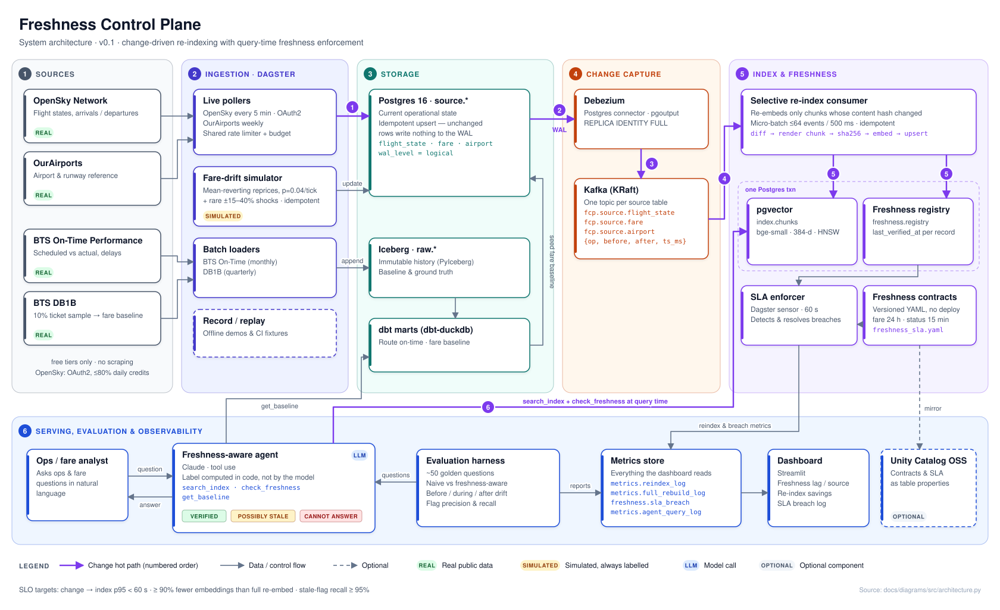
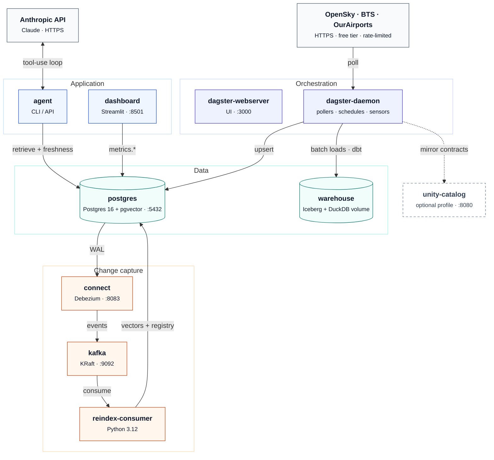

# ARD — Architecture Requirements & Decisions

| | |
|---|---|
| **Status** | Draft v0.1 |
| **Last updated** | 2026-10-02 |
| **Related** | [PRD](PRD.md) · [SDD](SDD.md) |

This document covers the system's components, how data flows between them, the architecture requirements that follow from the PRD, and the key decisions as ADRs. Detailed schemas and algorithms are in the [SDD](SDD.md).

## 1. System context

**Change hot path** (purple, numbered in the diagram):

| Step | What happens |
|---|---|
| ① | A poller upserts the current state into `source.*`. If nothing changed, nothing is written; only `last_verified_at` is refreshed. |
| ② | Postgres writes the change to its WAL, and Debezium reads it through a logical replication slot. |
| ③ | Debezium publishes `{op, before, after, ts_ms}` to the table's Kafka topic. |
| ④ | The re-index consumer reads events in micro-batches. |
| ⑤ | Only chunks whose content hash changed are re-embedded. The vector and the freshness registry are written in one transaction. |
| ⑥ | At query time, the agent retrieves chunks and checks their freshness against the contracts before answering. |

The diagram source is [`diagrams/src/architecture.py`](diagrams/src/architecture.py).

## 2. Components

| Component | Responsibility | Technology |
|---|---|---|
| Ingestion | Poll and download sources, apply rate limits, upsert current state, append history | Python, httpx, Dagster assets and schedules |
| Fare-drift simulator | Apply realistic fare changes on top of the DB1B baseline | Python, Dagster schedule |
| Source DB | Current operational state that CDC watches | Postgres 16 (`wal_level=logical`) |
| Lake / baseline | Immutable history and ground truth | Iceberg (PyIceberg SQL catalog), dbt-duckdb |
| CDC | Turn row changes into events | Debezium Postgres connector, Kafka (KRaft) |
| Re-index consumer | Collapse events, rebuild chunks, check hashes, embed only changed chunks, upsert vectors | Python, confluent-kafka, fastembed (ONNX) |
| Vector index | Retrieval | pgvector (HNSW) |
| Freshness registry | `last_verified_at` per record and chunk | Postgres schema `freshness` |
| SLA enforcer | Evaluate contracts and record breaches | Dagster sensor every 1 min |
| Agent | Retrieve, check freshness, generate a labeled answer | Claude API with tool use |
| Eval harness | Golden set, drift injection, scoring | pytest-style runner, JSON reports |
| Dashboard | Lag, savings and breaches | Streamlit |
| Catalog | Contract and freshness metadata | Unity Catalog OSS (optional, P1) |

## 3. Architecture requirements

| ID | Requirement | Traces to |
|---|---|---|
| AR-1 | Every change to the source tables must produce exactly one logical change event (at-least-once delivery, with idempotent consumers). | FR-3 |
| AR-2 | Re-indexing is driven by events and scoped to the record. No component may re-embed the full dataset, except the explicit baseline benchmark. | FR-4, NFR-2 |
| AR-3 | Embedding is content-addressed: a chunk is re-embedded only if `sha256(chunk_text)` changed. | FR-4 |
| AR-4 | Freshness is a first-class column on every chunk (`last_verified_at`, `source`, `simulated`). | FR-6, NFR-5 |
| AR-5 | SLAs are declared in config, not code. Changing one requires no deploy. | FR-7 |
| AR-6 | The agent never produces an answer without first calling the freshness check on every retrieved chunk it cites. | FR-9 |
| AR-7 | All external calls go through a shared rate limiter with a daily budget. | NFR-3 |
| AR-8 | The whole stack runs on one laptop with Docker Compose. | NFR-4 |
| AR-9 | Everything can be observed: every stage writes structured metrics to `metrics.*` tables, which the dashboard reads. | FR-5, FR-11 |

## 4. Architecture Decision Records

### ADR-001 — Pollers write to Postgres, and CDC reads Postgres
- **Context:** The sources are HTTP APIs and files. Debezium needs a database change log.
- **Decision:** Pollers *upsert* the current state into `source.*` tables, and Debezium reads the Postgres change log (WAL).
- **Consequences:**
  - Real API changes become real CDC events.
  - Unchanged polls produce no events, because the upsert is a no-op when values are identical (`ON CONFLICT ... WHERE row IS DISTINCT FROM`).
  - We gain a natural compare-and-skip step.
- **Alternative rejected:** Pollers publishing straight to Kafka. That gives no before/after image and no idempotent state, and it no longer demonstrates CDC.

### ADR-002 — Fares: BTS DB1B baseline plus simulated drift (replaces Amadeus)
- **Context:** The brief planned to use the Amadeus Self-Service sandbox, but Amadeus decommissioned Self-Service on **2026-07-17**. Live fare APIs are paid or tightly rate-limited.
- **Decision:** Use BTS DB1B (Airline Origin & Destination Survey, a 10% ticket sample, quarterly) as the *real* fare baseline. Aggregate it to route × quarter fare distributions, then simulate drift on top.
- **Consequences:**
  - The baseline is real, free and citable. The drift is simulated and labeled as such.
  - DB1B shows historical fares paid, not live offers, and the case study says so.

### ADR-003 — OpenSky is the live drift source; BTS is the baseline
- **Context:** OpenSky provides aircraft state vectors and arrival/departure records (first seen, last seen, estimated airports). It does **not** provide scheduled times, delays, cancellations or gates. BTS does provide those, but publishes about 2 months behind.
- **Decision:** Live drift comes from OpenSky state transitions (scheduled → airborne → landed, diversions). Delay context comes from joining with the BTS baseline per route, carrier and hour.
- **Consequences:**
  - The agent's ops questions are framed around live state plus historical performance, not live delay minutes.
  - Scope is US airports only.

### ADR-004 — pgvector in the source Postgres, not a separate vector DB
- **Decision:** Use pgvector with an HNSW index.
- **Consequences:**
  - One less service.
  - Vector updates and freshness updates commit in a single transaction, so the index and the registry can't disagree.
  - Not tuned for very large scale, which is acceptable at about 10⁵ chunks.

### ADR-005 — Local embedding model
- **Decision:** `BAAI/bge-small-en-v1.5` (384 dimensions), run through **fastembed** (ONNX Runtime). *Revised in Phase 3:* the original plan named sentence-transformers. fastembed gives the same model without PyTorch (a 64 MB model download instead of a ~700 MB framework install), plus the model's own tokenizer for exact token counts.
- **Consequences:**
  - Zero cost, and it runs offline once the model is cached in `data/models` (CI caches it too).
  - About 3–6 ms per chunk on an Apple-silicon laptop.
  - Cost is reported in **tokens counted by the model's tokenizer** and in embedding seconds. Any dollar figure in the case study states the price per token it assumes.

### ADR-006 — Freshness enforced at query time, not only at ingest
- **Decision:** The agent calls a `check_freshness(chunk_ids)` tool before it answers. The response format requires a freshness label.
- **Rationale:** An index can be up to date and the data still stale, for example when the source itself stops updating. Only a check at query time protects the answer.
- **Consequences:** Adds about 1 DB round-trip per query, which is negligible.

### ADR-007 — Dagster for orchestration; dbt-duckdb over Iceberg for the baseline
- **Decision:** Reuse the FlightPulse stack (Dagster, dbt, Iceberg). Run dbt against DuckDB reading Iceberg locally, with no Spark or Trino.
- **Consequences:**
  - Lightweight.
  - Moving to Spark or Trino in the cloud only changes the dbt adapter.

### ADR-008 — Unity Catalog OSS is optional
- **Decision:** Contracts and freshness metadata live first in Postgres (`freshness.contract`, `freshness.sla_breach`). They are mirrored to Unity Catalog OSS as table properties and tags when it is enabled.
- **Consequences:** The core demo has no dependency on Unity Catalog, and the catalog integration is still shown.

### ADR-009 — Positions go to a separate table that CDC does not capture
- **Context:** An airborne aircraft's position changes on every poll. If positions lived in `source.flight_state`, every poll would emit hundreds of CDC events and re-embeddings that carry no business meaning. That would defeat selective re-indexing.
- **Decision:** `source.*` holds business facts only (status, airports, times). Positions go to `telemetry.flight_position`, which is not part of the Debezium publication. Re-verification timestamps go to `freshness.registry`, which is also not captured.
- **Consequences:**
  - Measured on the first two live polls (2026-10-02): of 583 tracked flights, 448 (77%) produced no write to `source.*`. Only 36 real status changes and 99 new flights became change events.
  - The agent reads positions from telemetry when it needs them, but positions never trigger re-indexing.

### ADR-010 — Two freshness clocks, chosen per contract
- **Context:** "Fresh" means different things for different data. A live flight status is fresh if we re-checked it minutes ago. A BTS monthly statistic is "fresh" if it is the newest month BTS has published, even though that month ended 60+ days ago. One timestamp cannot express both.
- **Decision:** The registry keeps `last_verified_at` (when we last confirmed the value against its source) and `data_as_of` (the time the value describes). Each contract names the clock it measures (`measure` in `freshness_sla.yaml`).
- **Consequences:**
  - SLAs stay meaningful. `flight_status` is 15 min on `last_verified_at`; `fare_baseline` is 550 days on `data_as_of`, which is honest about DB1B's publication lag.
  - The agent can say both "checked 2 minutes ago" and "describes July 2026".

### ADR-011 — The fare baseline is the newest DB1B quarter, about 15 months old
- **Context:** In October 2026 the newest published DB1B quarter is 2025 Q2. BTS releases DB1B about 15 months after the quarter ends.
- **Decision:** Use it anyway, as the real historical baseline. Record its age through the `fare_baseline` contract, and require answers that use it to name the quarter.
- **Consequences:**
  - Fares in the demo describe 2025 Q2 price levels, and the case study says so.
  - Simulated drift (Phase 2) moves current fares away from this baseline. Drift is always labelled as simulated.

### ADR-012 — A dedicated CDC role, with its secret resolved inside Connect
- **Context:** Debezium needs `REPLICATION` and read access to the captured tables. Running it as the database owner would give a streaming component full write access. Putting the password in the connector config would store it in Kafka and expose it through the Connect REST API.
- **Decision:** Debezium connects as `fcp_cdc` (migration 0002), which has `LOGIN REPLICATION` and `SELECT` on `source.*` only. The connector config says `${env:FCP_CDC_PASSWORD}`, which Kafka's `EnvVarConfigProvider` resolves inside the worker. The migrator sets the role's password from the same variable.
- **Consequences:**
  - `GET /connectors/fcp-source/config` returns the placeholder, never the secret (verified).
  - The role cannot read `freshness`, `metrics` or `ops`.

### ADR-013 — Versioned SQL migrations instead of image init scripts
- **Context:** The Postgres image runs `docker-entrypoint-initdb.d` only on an empty data directory, so Phase 2's schema changes would never reach an existing environment.
- **Decision:** `db/migrations/NNNN_name.sql`, applied in order by `fcp db upgrade` (run by `make up` and CI). Each file runs in its own transaction and is recorded with a SHA-256 checksum in `ops.schema_migrations`; editing an applied file is an error. Phase 1 databases adopt 0001 instead of re-running it.
- **Consequences:**
  - Any phase can change the schema safely.
  - Migrations are forward-only; this is a portfolio stack, not a multi-tenant service.

### ADR-014 — Kafka data on a real volume; delivery treated as at-least-once
- **Context:** In development, recreating the Kafka container silently emptied every topic. The `apache/kafka` image writes to `/tmp/kraft-combined-logs` unless `KAFKA_LOG_DIRS` is set, so our volume was never used. Losing Connect's offsets then made Debezium re-snapshot every table. Separately, Connect saves source offsets only every 60 s by default, so a restart soon after a burst re-sends that burst.
- **Decision:**
  - Set `KAFKA_LOG_DIRS=/var/lib/kafka/data`; verified that topics and the connector survive a forced recreate.
  - Save offsets every 10 s.
  - Design every consumer to be idempotent rather than assume exactly-once delivery.
- **Consequences:**
  - A restart replays at most about 10 s of events (verified: a Connect restart produced no duplicates).
  - The Phase 3 consumer must skip events whose chunk content hash is unchanged. It already does by design (SDD §4).

### ADR-015 — Index lag is a source of staleness, measured per chunk
- **Context:** A record can be freshly verified at its source while the vector index still holds an older version, for example if the re-index consumer is paused, behind, or crashed. A query-time check that only looks at source verification would call that answer fresh. This is the exact failure the project exists to catch, and the Phase 6 evaluation deliberately creates it.
- **Decision:** Each chunk stores `source_changed_at`, the source row's `updated_at` at the time it was embedded. The index is behind for a record when `source.<table>.updated_at > chunks.source_changed_at`. Both timestamps come from the same Postgres clock, so the comparison is exact.
- **Consequences:**
  - `fcp reindex status` reports chunks that are missing, behind or orphaned, per table.
  - Phase 5's `check_freshness` must combine source freshness (contract clock) with index lag. An answer built from a chunk that is behind is never `VERIFIED`.

### ADR-016 — The freshness registry belongs to ingestion, not to the index
- **Context:** The SDD originally had the consumer update `freshness.registry` in its own transaction.
- **Decision:** Only ingestion writes the registry: it knows when a value was verified and when it changed. The consumer writes chunks and metrics only. The index's own freshness is the source version stored on each chunk (ADR-015).
- **Consequences:**
  - One writer per fact.
  - The registry stays correct even while the consumer is down, which is exactly when it matters.

## 5. Deployment view (local)

`docker-compose.yml` runs these services:

| Service | Role |
|---|---|
| `postgres` | Postgres 16 with pgvector and logical replication |
| `kafka` | Kafka (KRaft mode) |
| `connect` | Debezium |
| `dagster-webserver`, `dagster-daemon` | Orchestration |
| `reindex-consumer` | Selective re-index |
| `dashboard` | Streamlit |
| `unity-catalog` | Optional, via a Compose profile |

Iceberg data sits in a `./warehouse` volume. Terraform (`infra/terraform`) is a later, optional cloud target (managed Postgres, MSK/Confluent, S3 for Iceberg).

## 6. Security and compliance
- Secrets (`OPENSKY_CLIENT_ID/SECRET`, `ANTHROPIC_API_KEY`) are kept only in `.env`, which git ignores.
- OpenSky's terms are for non-commercial or research use, and this project is a non-commercial portfolio piece. Attribution goes in the README.
- No personal data is stored. Aircraft are identified by ICAO24 and callsign only.
