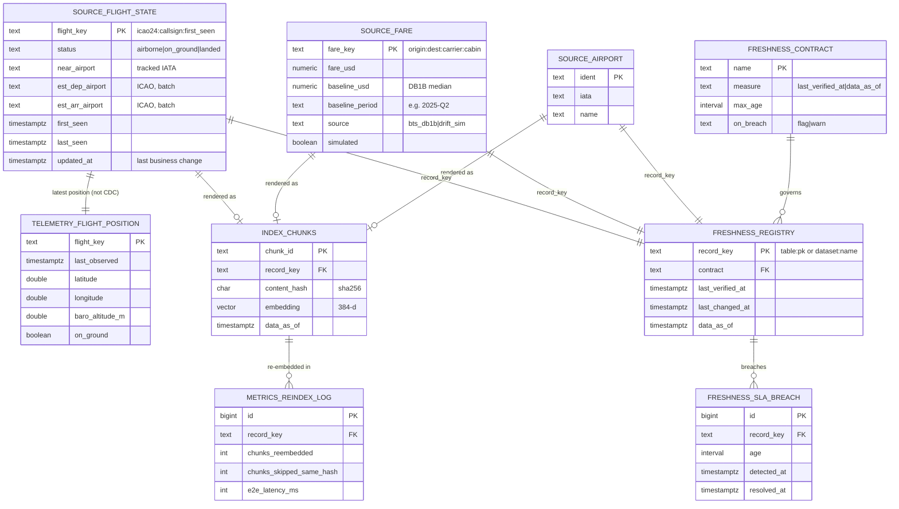
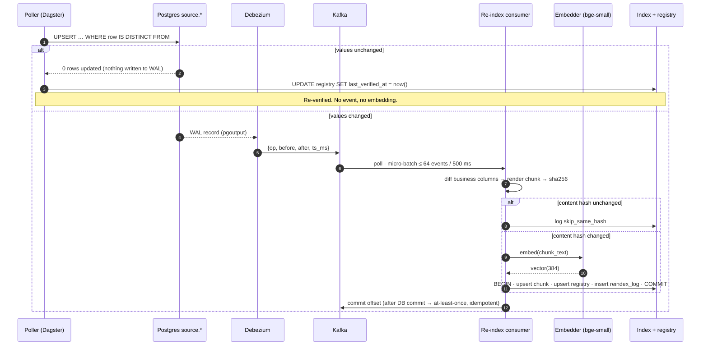
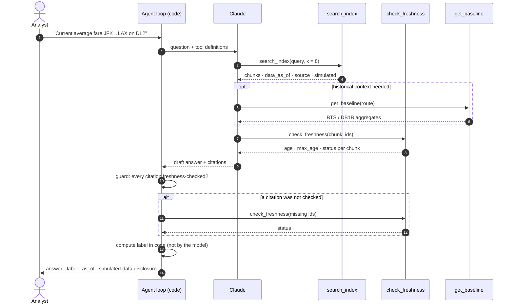
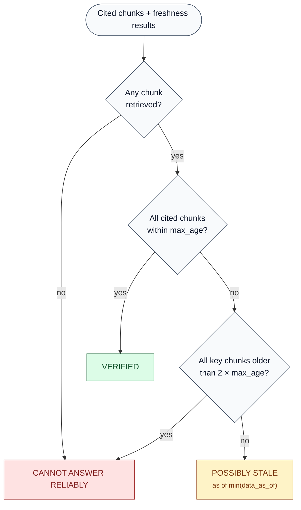
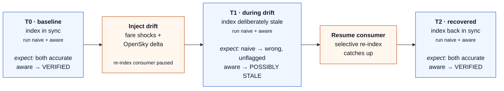

# SDD — Software Design Document

| | |
|---|---|
| **Status** | Draft v0.1 |
| **Last updated** | 2026-10-02 |
| **Related** | [PRD](PRD.md) · [ARD](ARD.md) |

## 1. Repository layout

Python code lives in one package (`src/fcp`). Everything that is not Python stays at the top level.

```
src/fcp/
  cli.py                       `fcp` command: ingest / dbt / seed / status
  common/                      settings, structured logging, Postgres helpers, API budget, airports
    db.py                      change-aware upsert, freshness registry, run logging
    ratelimit.py               daily credit budget (AR-7)
  ingestion/
    opensky/client.py          OAuth2, credit costs, record/replay
    opensky/transform.py       pure parsing + flight identity (unit-tested)
    opensky/poller.py          states (live) + flights (daily) -> source.flight_state
    bts/ontime.py              monthly CSV -> Iceberg raw.bts_ontime
    bts/db1b.py                quarterly CSV -> Iceberg raw.db1b_market
    ourairports.py             -> source.airport
    fares/baseline.py          dbt mart_fare_baseline -> source.fare
    fares/drift.py             SIMULATED fare drift (idempotent ticks)
    lake.py                    PyIceberg SQL catalog, idempotent partition replace
  cdc/connect.py               Debezium connector: register, status, self-heal
  cdc/events.py                Debezium message -> ChangeEvent (record id, commit time, delta)
  cdc/consumer.py              Kafka consumption, `cdc tail`, `cdc stats`
  common/migrate.py            ordered SQL migrations (db/migrations)
  transform/dbt.py             runs dbt against the same catalog
  freshness/contracts.py       YAML -> freshness.contract
  orchestration/definitions.py Dagster assets, jobs, schedules
  (Phase 3+: reindex/, agent/, eval/, dashboard/)
dbt/                           staging + marts over Iceberg (dbt-duckdb iceberg plugin)
db/migrations/NNNN_*.sql       Postgres schema, applied in order by `fcp db upgrade`
contracts/freshness_sla.yaml   freshness SLAs
cdc/debezium/fcp-source.json   Debezium connector config
eval/golden/                   golden questions (Phase 6)
tests/unit, tests/integration
```

## 2. Data model (Postgres)



Keys: `record_key = <table>:<pk>` joins the source rows, chunks, registry and metrics. `contract` joins the registry to its contract.

### 2.1 `source.*` and `telemetry.*`

The full DDL is in [`db/migrations/`](../db/migrations/). These are the design rules it follows:

- **`source.*` changes only when a business fact changes.** `source.flight_state`, `source.fare` and `source.airport` are captured by CDC. Every write is a change-aware upsert:

  ```sql
  insert ... on conflict (pk) do update set ...
  where (t.business_cols) is distinct from (new_values)
  returning pk, (xmax = 0) as inserted
  ```

  An unchanged row is not written at all, so it produces no WAL record, no Debezium event and no embedding. The integration tests check this by asserting that the row's `xmin` stays the same.
- **High-churn observations live in `telemetry.*`.** An aircraft's position changes on every poll, but that is not a business change. `telemetry.flight_position` is excluded from the Debezium publication.
- **Flight identity.** `flight_key = icao24:callsign:first_seen_epoch`. A sighting of the same aircraft and callsign within 6 hours of the last one is the same flight. When the next day's batch record arrives, it is matched to the live-tracked flight if our first sighting falls within `[firstSeen − 3 h, lastSeen]`.
- **Flight status** is `airborne`, `on_ground` or `landed`. `landed` is final for a key, and batch-only fields (estimated airports, `last_seen`) are never erased by a live poll. Both rules are enforced inside the upsert with `case` / `coalesce` overrides.
- **Fares.** `source.fare` carries `baseline_usd` and `baseline_period` (the DB1B quarter), plus `source` (`bts_db1b` or `drift_sim`) and `simulated`. Re-seeding the same quarter never overwrites a simulated fare; a new quarter resets all fares to the new baseline.

### 2.2 `index.chunks`: vector index

```sql
create table index.chunks (
  chunk_id         text primary key,      -- <table>:<pk>
  source_table     text not null,
  record_key       text not null,
  chunk_text       text not null,
  content_hash     char(64) not null,     -- sha256(chunk_text)
  embedding        vector(384) not null,
  source           text not null,
  simulated        boolean not null,
  data_as_of       timestamptz not null,  -- record's effective/fetched time
  indexed_at       timestamptz not null
);
create index on index.chunks using hnsw (embedding vector_cosine_ops);
```

### 2.3 `freshness.*`

`freshness.registry` has one row per source record (`<table>:<pk>`), or per lake dataset (`dataset:raw.bts_ontime`). It keeps three timestamps, and each contract measures one of the two clocks, `last_verified_at` or `data_as_of`:

| Column | Meaning | Written by |
|---|---|---|
| `last_verified_at` | When we last confirmed the value against its source | Every poll or load, changed or not |
| `last_changed_at` | When the value last actually changed | Only on a real change |
| `data_as_of` | The point in time the value describes (aircraft last contact, BTS month end, DB1B quarter end) | Every poll or load |

Each contract in [`contracts/freshness_sla.yaml`](../contracts/freshness_sla.yaml) says which clock its SLA uses:

| Contract | Measures | Max age | Why |
|---|---|---|---|
| `flight_status` | `last_verified_at` | 15 min | Polled every 5 min; 3 missed polls means stale |
| `fare` | `last_verified_at` | 24 h | Current-fare questions |
| `airport_reference` | `last_verified_at` | 14 d | Weekly refresh |
| `on_time_performance` | `data_as_of` | 100 d | BTS publishes about 60 days after month end |
| `fare_baseline` | `data_as_of` | 550 d | DB1B publishes about 15 months after quarter end |

`freshness.registry` is not captured by CDC, so re-verifying an unchanged record costs one small update and no embedding.

### 2.4 `metrics.*` and `ops.*`

| Table | Written by | Purpose |
|---|---|---|
| `metrics.ingest_run` | Every ingestion step, including failures (`fcp.common.db.track_run`) | Rows seen, changed and unchanged; credits used. This is the Phase 1 evidence for selective change |
| `metrics.reindex_log` | Re-index consumer (Phase 3) | Chunks considered, re-embedded and skipped by hash; end-to-end latency |
| `metrics.full_rebuild_log` | Full re-embed benchmark (Phase 3) | Baseline for the savings metric |
| `metrics.agent_query_log` | Agent (Phase 5) | Question, mode, cited chunks, label |
| `ops.api_budget` | `fcp.common.ratelimit` | Daily credits per provider and endpoint |

## 3. CDC

### 3.1 Connector

The connector config is [`cdc/debezium/fcp-source.json`](../cdc/debezium/fcp-source.json). `fcp cdc register` applies it with an idempotent `PUT /connectors/fcp-source/config`.

| Setting | Value | Why |
|---|---|---|
| `database.user` | `fcp_cdc` | Least-privilege role: `REPLICATION` plus `SELECT` on `source.*` only (ADR-012) |
| `database.password` | `${env:FCP_CDC_PASSWORD}` | Resolved inside the Connect worker by `EnvVarConfigProvider`. The REST API and the stored config only ever show the placeholder |
| `plugin.name` / `publication.name` | `pgoutput` / `fcp_source` | Built-in logical decoding. The publication comes from migration 0001 (`publication.autocreate.mode = disabled`) |
| `table.include.list` | `source.flight_state, source.fare, source.airport` | `telemetry.*` and `freshness.*` are deliberately excluded (ADR-009) |
| `snapshot.mode` | `initial` | Existing rows arrive once as `op = r`, then streaming starts |
| Converters | JSON, `schemas.enable = false` | Small, readable messages; the schema is the Postgres table |
| `decimal.handling.mode` | `string` | `fare_usd` arrives as `"226.75"`, never as a rounded float |
| Topics | `fcp.source.<table>`, 3 partitions, 7-day retention, **created by `fcp cdc register`** | Keyed by primary key, so all changes to one record stay in order. Creating them up front means a consumer started on an empty database cannot miss the first events while waiting for the topic to appear (found by CI, which starts empty) |
| Unwrap SMT | Not applied | The consumer needs both `before` and `after` |

`REPLICA IDENTITY FULL` on the source tables makes the `before` image complete.

**Delivery is at least once.** Connect saves its position every 10 s (`OFFSET_FLUSH_INTERVAL_MS`), so a crash can replay up to about 10 s of changes. If Connect's offsets are lost entirely, it falls back to a full re-snapshot; we saw this once during development, and it is how we found the Kafka log-dir bug (ADR-014). Every consumer must therefore be idempotent. The Phase 3 consumer is, because it skips any chunk whose content hash has not changed.

### 3.2 Event contract

This is a real message, captured from the local stack and stored in [`tests/fixtures/debezium/`](../tests/fixtures/debezium/), trimmed:

```json
{
  "op": "u",
  "ts_ms": 1791055750080,
  "source": {
    "schema": "source",
    "table": "airport",
    "ts_ms": 1791055749775,
    "lsn": 36767864
  },
  "before": {
    "ident": "TEST-FIXTURE",
    "name": "Fixture Field",
    "updated_at": "2026-10-03T19:29:09.773111Z",
    "...": "..."
  },
  "after": {
    "ident": "TEST-FIXTURE",
    "name": "Fixture Field Renamed",
    "updated_at": "2026-10-03T19:29:09.775405Z",
    "...": "..."
  }
}
```

`fcp.cdc.events.parse` turns every message into a `ChangeEvent`, which carries exactly what the brief asks for (record ID, change timestamp, delta):

| Field | Meaning |
|---|---|
| `record_key` | `source.airport:TEST-FIXTURE`, the same key as `freshness.registry` and `index.chunks` |
| `committed_at` | Postgres commit time (`source.ts_ms`) |
| `captured_at` | When Debezium processed the change (`ts_ms`) |
| `delta` | `{"name": ("Fixture Field", "Fixture Field Renamed")}`: only the columns that changed. `updated_at` is excluded because it changes with every business change |

### 3.3 Operations

| Command | What it does |
|---|---|
| `fcp cdc register` / `status` | Apply the config and wait until it is `RUNNING`; show its state |
| `fcp cdc tail` | Live view: one line per event with its delta and commit-to-consumer latency |
| `fcp cdc stats --seconds N` | p50 / p95 latency per table and operation, written to `metrics.cdc_window` |
| Dagster sensor `cdc_connector_health` | Every 60 s. If the connector is missing or a task has failed, it runs `cdc_heal`, which re-registers or restarts only the failed tasks. Tested by deleting the connector: it resumed from saved offsets with no re-snapshot |

## 4. Selective re-index algorithm



Pseudo-code:

```
on event e:
  key      = e.source.table + ":" + pk(e.after or e.before)
  if e.op == 'd':
      delete from index.chunks where record_key = key; log; commit offset; return
  changed  = {col for col in business_cols(table) if before[col] != after[col]}
  if changed == ∅: log skip; commit; return               # e.g. housekeeping-only update
  text     = chunker.render(table, e.after)                # deterministic template
  h        = sha256(text)
  if h == current_hash(key): log skip_same_hash; commit; return
  vec      = embed(text)
  BEGIN
    upsert index.chunks(chunk_id, text, h, vec, data_as_of, indexed_at=now())
    upsert freshness.registry(key, last_changed_at=now(), last_verified_at=now())
    insert metrics.reindex_log(...)
  COMMIT
  commit kafka offset                                      # after DB commit → at-least-once, idempotent by hash
```

- **One chunk per record in v1.** Records are small, and the templates are written as natural-language facts. For example: *"Fare JFK→LAX on DL economy: $289.00 as of 2026-10-02T14:00Z (simulated drift; DB1B Q2-2026 median $264.00)."*
- **Batching.** The consumer micro-batches up to 64 events or 500 ms before embedding.
- **Baseline benchmark.** `full_rebuild.py` re-embeds every record and logs to `metrics.full_rebuild_log`.
- **Savings metric:**
  `savings = 1 − Σ chunks_reembedded / (full_rebuild_chunks × rebuild_count_equivalent)`
  Here `rebuild_count_equivalent` is how many times the naive approach would rebuild in the same window, for example hourly. The method is stated in the case study.

## 5. Freshness SLA enforcement

1. **Load contracts.** `contracts/freshness_sla.yaml` is loaded into `freshness.contract` at startup and whenever the file's hash changes (AR-5).
2. **Run the enforcer.** A Dagster sensor runs every 60 s and executes:
   ```sql
   select r.record_key, r.contract, c.max_age,
          now() - case c.measure when 'last_verified_at' then r.last_verified_at
                                 else r.data_as_of end as age
   from freshness.registry r join freshness.contract c on c.name = r.contract
   where now() - case c.measure when 'last_verified_at' then r.last_verified_at
                                else r.data_as_of end > c.max_age;
   ```
3. **Record breaches.** New breaches are inserted, and a breach is resolved when the record is verified again.
4. **Roll up per contract.** `breach_pct`, `p50_age` and `p95_age` per contract are written to `metrics.freshness_snapshot` for the dashboard.
5. **Catalog sync (optional).** When the catalog is enabled, `freshness.sla_hours` and `freshness.last_breach_at` are written as Unity Catalog table properties.

## 6. Freshness-aware agent

**Model:** Claude Sonnet (latest), via the Anthropic SDK with tool use.

**Tools:**

| Tool | Returns |
|---|---|
| `search_index(query, k=8, filters)` | Chunks with `chunk_id`, `text`, `data_as_of`, `source`, `simulated` |
| `check_freshness(chunk_ids)` | Per chunk: `age`, `max_age`, `status ∈ {fresh, stale, unknown}` |
| `get_baseline(route|airport)` | BTS on-time stats from the dbt marts, used for context |

**Policy** (system prompt plus a final check in code):
- Every factual claim must cite chunk IDs.
- `check_freshness` must be called on every cited chunk before answering. The code enforces this: if it wasn't called, the agent loop forces the call.
- The label is computed **in code** from the freshness results, not chosen by the model:

  | Freshness result | Label |
  |---|---|
  | All cited chunks fresh | `VERIFIED` |
  | Any cited chunk stale | `POSSIBLY STALE — data as of <min data_as_of>` |
  | All key chunks stale and past `2 × max_age`, or nothing retrieved | `CANNOT ANSWER RELIABLY` |

- Simulated data is always disclosed in the answer footer.

**Query flow:**



**Label decision** (pure function in `agent/labels.py`, unit-tested):



**Response schema:**

```json
{ "answer": "...", "label": "VERIFIED|POSSIBLY_STALE|CANNOT_ANSWER",
  "as_of": "2026-10-02T14:00:00Z", "citations": ["source.fare:JFK:LAX:DL:Y"],
  "simulated_data_used": true }
```

**Naive mode** (for the eval): same retrieval, no `check_freshness`, and no label.

## 7. Evaluation design



- **Golden set** (`eval/golden/*.yaml`): about 50 questions.

  | Group | Count | Example |
  |---|---|---|
  | Fares | ~20 | "current fare JFK→LAX on DL" |
  | Flight state | ~20 | "has callsign UAL123 landed?" |
  | Baseline | ~10 | "ORD→SFO on-time % in June" |

  Each question has an `expected_fn`, which computes the correct answer from the current `source.*` state at eval time, so ground truth moves with drift.
- **Protocol:**
  1. Snapshot T0, then run naive and aware.
  2. Inject drift: apply a fare-shock batch and replay a recorded OpenSky delta. With the re-index consumer **paused**, this creates an index that is stale on purpose.
  3. Run both modes. Aware should flag the stale answers, and naive should answer wrongly with confidence.
  4. Resume the consumer, then run both again. Aware should return `VERIFIED` with correct answers.
- **Scoring:**
  - `accuracy`: numeric answers within tolerance (fares ±1%), categorical answers exact match.
  - `confident_wrong_rate`
  - `stale_flag_precision` and `stale_flag_recall`, with ground truth "is stale" = cited data older than its SLA or different from the current source.
- **Output:** `eval/reports/<ts>.json` plus a markdown summary that the case study uses.

## 8. Ingestion details

| Source | Cadence | Cost and budget |
|---|---|---|
| OpenSky `/states/all`, one bounding box around all 8 airports (about 16° × 51°) | Every 5 min with credentials, every 20 min anonymous | 4 credits per call: 1,152 per day with credentials (of 3,200 allowed), 288 anonymous (of 320) |
| OpenSky `/flights/arrival` and `/flights/departure` per airport, previous UTC day | Daily, 06:00 UTC | 30 credits × 8 airports = 240 per endpoint per day |
| BTS On-Time | Weekly check; newest 6 months kept | Bulk download (about 32 MB per month), cached |
| BTS DB1B Market | Weekly check; newest quarter | Bulk download (about 110 MB, 2.1 GB unzipped), cached |
| OurAirports | Weekly | One CSV |
| Fare drift simulator (simulated) | Every 15 min | Each fare reprices with p = 0.04 per tick: a mean-reverting log-price step (θ = 0.2, σ = 0.06), plus rare shocks (p = 0.002, ±15–40%). Whole dollars, bounded to 0.4–2.5 × baseline. Ticks are idempotent (`ops.drift_tick`) |

**Budget rules.** Every OpenSky call reserves its cost in `ops.api_budget` before it is made, using one conditional update, so concurrent runs cannot overspend. If the request never reached OpenSky, the credits are refunded. After each call the budget is reconciled with OpenSky's `X-Rate-Limit-Remaining` header.

**Record and replay.** With `FCP_OPENSKY_MODE=record`, every response is saved to `data/recordings/opensky/`. With `replay`, those responses are served in capture order and no credits are spent; this is used for demos and offline runs.

**Lake loads are idempotent.** Each load replaces its own month or quarter in a single Iceberg snapshot (`overwrite` with a partition filter).

Source details, filters and attribution are in [data-sources.md](data-sources.md).

## 9. Observability

- Structured JSON logs that include `record_key` and `kafka_offset`.
- All metrics are kept in `metrics.*` (AR-9), and the dashboard reads only from these tables.
- Dagster run history covers the pollers, the enforcer and dbt.

## 10. Testing

| Layer | Tests |
|---|---|
| Unit | Chunker determinism, hash skip, label computation, rate limiter, drift-sim distribution |
| Contract | Debezium event fixture → consumer produces the expected DB writes |
| Integration | Docker Compose up → upsert a fare → vector updated within 60 s (NFR-1) |
| dbt | `unique`, `not_null`, `accepted_values(status)`, source freshness |
| Eval | Golden-set run in CI on recorded data, with the Claude call mocked for determinism |

## 11. Phase 1 build checklist
- [x] `docker-compose.yml` (Postgres 16 + pgvector 0.8.2, Kafka 4.3 KRaft, Debezium Connect 3.5) and `Makefile`
- [x] Database schema for every table in §2 (now `db/migrations/0001_initial.sql`)
- [x] `fcp.common.ratelimit`: daily credit budget with reconcile and refund
- [x] OpenSky client and pollers (OAuth2, record and replay, states + flights)
- [x] BTS On-Time and DB1B loaders → Iceberg raw
- [x] OurAirports loader
- [x] Fare baseline from DB1B → `source.fare`
- [x] dbt staging + marts (`mart_route_ontime`, `mart_airport_hourly_delay`, `mart_fare_baseline`) with tests
- [x] Dagster assets, jobs and schedules
- [x] `docs/data-sources.md`
- [x] CI: ruff, mypy `--strict`, and unit + integration tests against Postgres

## 12. Phase 2 build checklist
- [x] Versioned migrations (`fcp db upgrade`), adopting Phase 1 databases (ADR-013)
- [x] Least-privilege `fcp_cdc` role; secret resolved through `EnvVarConfigProvider` (ADR-012)
- [x] Debezium connector config plus idempotent registration; topics with 3 partitions and 7-day retention
- [x] `ChangeEvent` parser (record ID, commit time, delta), tested against real captured messages
- [x] `fcp cdc tail` and `fcp cdc stats` (latency written to `metrics.cdc_window`)
- [x] Fare-drift simulator: reproducible, idempotent ticks, labelled as simulated; plus `drift shock` for the eval
- [x] Dagster: `fare_drift` asset on a 15-minute schedule; `cdc_connector_health` self-healing sensor
- [x] CI runs the full docker compose stack, including an end-to-end CDC test
- [x] Fixed: Kafka data persistence and offset flush interval (ADR-014)
